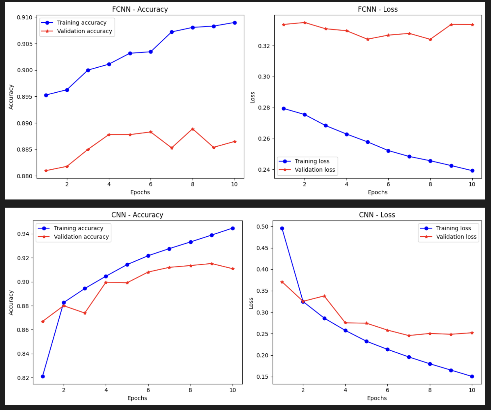

# 🧠 FCNN vs CNN on Fashion-MNIST

This project compares a **Fully Connected Neural Network (FCNN)** and a **Convolutional Neural Network (CNN)** using the Fashion-MNIST dataset with TensorFlow/Keras. The aim is to analyze their performance in image classification based on accuracy and loss.

## 🔧 Features
- Dataset: Fashion-MNIST
- Framework: TensorFlow & Keras
- Models implemented:
  - FCNN (with normalized flattened inputs)
  - CNN (with convolutional + pooling layers)
- Plots of training & validation accuracy/loss
- Evaluation and comparison of both models

## 📁 Files
- `CS455_Ass07_py.ipynb`: Main notebook with FCNN and CNN implementations.
- `~$signment 07 Report.docx`: Summary of methodology, performance graphs, and results.
  

## 📊 Results
- ✅ Final Test Accuracy of FCNN: **88.65%**
- ✅ Final Test Accuracy of CNN: **91.05%**

Below is a comparison of training/validation performance:

## 📌 Usage
Run the notebook in Google Colab or any local Jupyter environment with TensorFlow installed.
